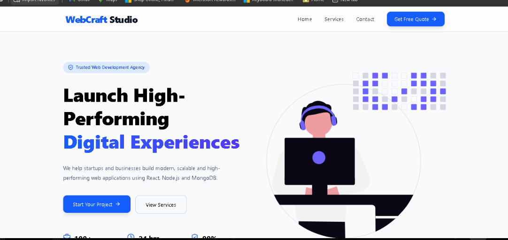
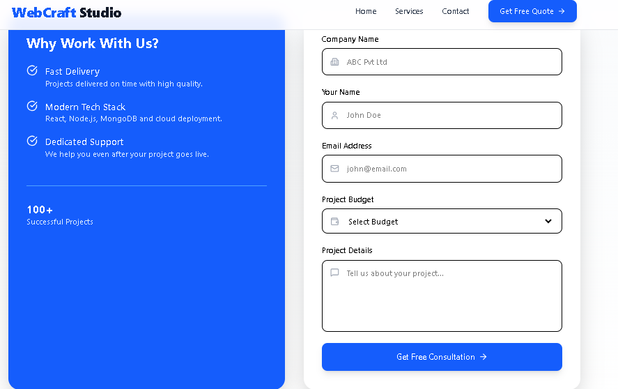
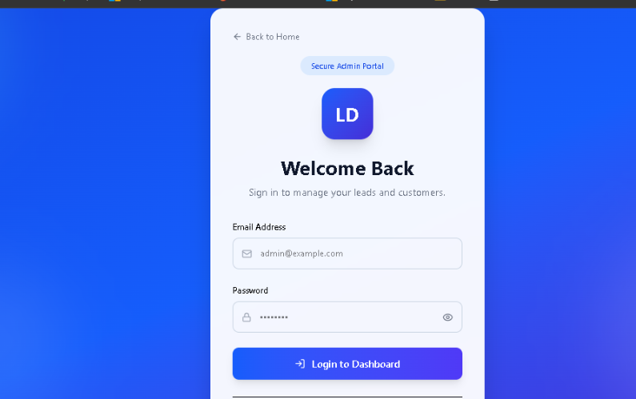
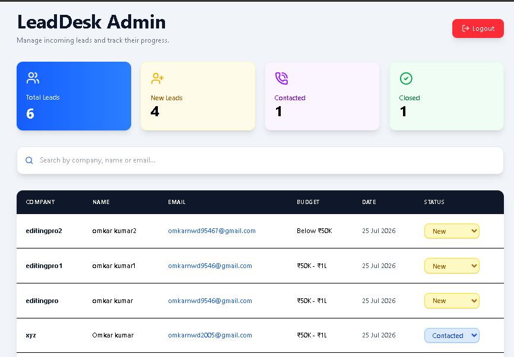

# 🚀 LeadDesk Mini

A modern full-stack Lead Management System built using the MERN Stack. It allows businesses to collect client inquiries through a landing page and manage them through a secure admin dashboard.


---

## 🌐 Live Demo

### Frontend (Vercel)
https://leaddesk-mini-liard.vercel.app

### Backend (Render)
https://leaddesk-backend-p357.onrender.com

---

# ✨ Features

## Landing Page

- Modern responsive UI
- Professional Hero Section
- Services Section
- Contact Form
- Beautiful Footer

## Lead Management

- Submit new leads
- Store leads in MongoDB Atlas
- Success toast notifications
- Form validation

## Admin Dashboard

- Secure Login (JWT Authentication)
- Protected Routes
- View all leads
- Search leads
- Update lead status
- Dashboard statistics
- Responsive data table

---

# 🛠 Tech Stack

## Frontend

- React
- Vite
- Tailwind CSS
- React Router
- Axios
- React Hot Toast
- Lucide React Icons

## Backend

- Node.js
- Express.js
- MongoDB Atlas
- Mongoose
- JWT Authentication
- bcryptjs
- CORS

## Deployment

- Frontend → Vercel
- Backend → Render
- Database → MongoDB Atlas

---

# 📁 Project Structure

```
LeadDesk-Mini
│
├── client
│   ├── src
│   ├── public
│   ├── package.json
│   └── ...
│
├── server
│   ├── controllers
│   ├── models
│   ├── routes
│   ├── middleware
│   ├── config
│   └── ...
│
└── README.md
```

---

# ⚙ Installation

## Clone Repository

```bash
git clone https://github.com/omkarrkr/leaddesk-mini.git
```

---

## Install Frontend

```bash
cd client
npm install
npm run dev
```

---

## Install Backend

```bash
cd server
npm install
npm run dev
```

---

# 🔐 Environment Variables

Create a `.env` file inside the `server` folder.

```
PORT=5000

MONGO_URI=your_mongodb_connection_string

JWT_SECRET=your_secret_key
```

---

# 📸 Screenshots

## 🏠 Home Page



---

## 📝 Lead Form



---

## 🔐 Admin Login



---

## 📊 Admin Dashboard



# 📌 Future Improvements

- Export leads to CSV
- Email notifications
- Admin profile management
- Pagination
- Analytics Dashboard
- Dark Mode

---

# 👨‍💻 Author

**Omkar Kumar**

B.Tech CSE Student

BMS College of Engineering

GitHub:
https://github.com/omkarrkr

---

# 📄 License

This project is created for educational and training purposes.